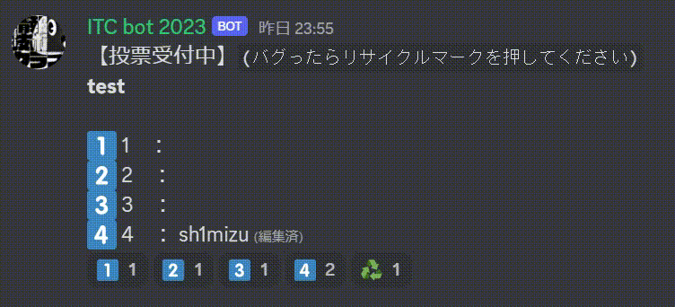

# ITC bot 2023 取扱説明書
- コマンドは随時追加予定。

⚠️コマンドは`BOT使用`のロールが付与されていないと使用できません。

⚠️ コマンドを入力する時はbot-consoleチャンネルを使用してください。


<!--
---
# 目次
- BOTを使用するための準備
- コマンド一覧
  - !shuffle
  - !vote
    - create
  - !vote_role
  - !get_date
- あとがき
- 更新履歴

---
# BOTを使用するための準備
## 開発者モードをONにする。
1. Discordのユーザー設定を開く
1. 「アプリの設定」にある「詳細設定」を押す
1. 開発者モードをONにする。


## チャンネル/メンバーIDの取り方
コマンド内に出てくる〇〇IDは、以下の方法で取得したIDを使用してください。

1. 取得したいボイス/テキストチャンネルorメンバーの上で右クリック
1. 一番下の「IDをコピー」をクリック


---
# コマンド一覧

## !shuffle


自分が入っているボイスチャンネルの人を指定したボイスチャンネルにランダムに振り分け、自動的に移動させるコマンドです。
```
!shuffle [ボイスチャンネルID 1] [ボイスチャンネルID 2] ...

例：
!shuffle 123456789012345678 123456789012345679
```
- ↑ボイスチャンネルのみ指定すると、指定したボイスチャンネルにランダムに振り分けることができます。

```
!shuffle [(任意)ロール 1] [(任意)ロール 2] [(任意)ロール 3] [ボイスチャンネルID 1] [ボイスチャンネルID 2] ...

例：
!shuffle @DTM部 @CG部 123456789012345678 123456789012345679
```
↑ロールを指定すると、指定したロールのメンバーは均等に振り分けられます。
ロールは0~3個の間で指定することができます。


## !vote

投票を作成して様々なことができる予定の機能です。
### !vote create


```
!vote create [テキストチャンネルID] [投票タイトル] [投票先1] [投票先2] [投票先3] ...

例:
!vote create 123456789012345678 学部は？ 工学部 先進工学部 薬学部 その他
!vote create 123456789012345678 @prog部昼ごはん食べた？__⚠️期限：~2/20__ はい 食べない 今から
```
投票タイトルに空白や改行は使用できません。


選択肢に投票したメンバーの名前がリアルタイムで表示されます。

投票結果がバグったときはリサイクルマークを押してください。


---
# あとがき

## 参考リンク
- discord.py APIリファレンス - (https://discordpy.readthedocs.io/ja/latest/api.html)
- heroku - (https://dashboard.heroku.com/)
  
---
# 更新履歴
### 2022/12/**
- ITC bot ver1.1.0から移植。

### 2023/2/3
- voteコマンドを削除。

### 2023/2/4
- shuffleコマンドの軽微な修正。
- Readmeを執筆。

### 2023/2/5
- voteコマンドの追加。
-->
