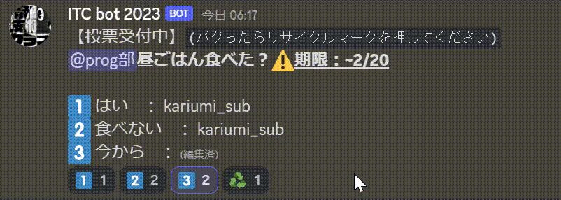

# ITC bot 2023 取扱説明書
- 高度な操作ができるため、`BOT使用`のロールが付与されていないと使用できません。
- コマンドは随時追加予定。


# 目次

- [コマンド一覧](#コマンド一覧)
  - [!shuffle](#shuffle) - メンバーをボイスチャンネルに均等に振り分ける
  - [!vote](#vote)
    - [create](#vote-create) - 投票を作成する
    - [role](#vote-role) - 投票者にロールを与える(未実装)
- [更新履歴](#更新履歴)

# コマンド一覧

## !shuffle

自分が入っているボイスチャンネルの人を指定したボイスチャンネルにランダムに振り分け、自動的に移動させるコマンドです。
```Python
!shuffle [ボイスチャンネルID 1] [ボイスチャンネルID 2] ...

例：
!shuffle 123456789012345678 123456789012345679
```
上記のように指定すると、指定したボイスチャンネルにランダムに振り分けることができます。
```Python
!shuffle [(任意)ロール 1] [(任意)ロール 2] [(任意)ロール 3] [ボイスチャンネルID 1] [ボイスチャンネルID 2] ...

例：
!shuffle @DTM部 @CG部 123456789012345678 123456789012345679
```
上記のようにロールを指定すると、指定したロールのメンバーは均等に振り分けられます。
- ロールは0~3個の間で指定することができます。


## !vote

投票を作成して様々なことができる機能です。```!vote```のみで実行するとvoteコマンドの説明が表示されます。
### !vote create
```Python
!vote create [投票タイトル] [投票先1] [投票先2] [投票先3] ...

例:
!vote create 学部は？ 工学部 先進工学部 薬学部 その他
!vote create @prog部昼ごはん食べた？__⚠️期限：~2/20__ はい 食べない 今から
```
選択肢に投票したメンバーの名前がリアルタイムで表示されます。複数人が同時に投票すると***バグることがあるので、その時はリサイクルマークを押すと正しく表示されます。***

- うまくやるとメンションや、下線文字、絵文字も含めることができます。
⚠️投票タイトルに空白や改行は使用できません。

  
  
  
# 更新履歴
### 2022/12/**
- ITC bot ver1.1.0から移植。

### 2023/2/3
- voteコマンドを削除。

### 2023/2/4
- shuffleコマンドの軽微な修正。
- Readmeを執筆。

### 2023/2/5
- voteコマンドの追加。
